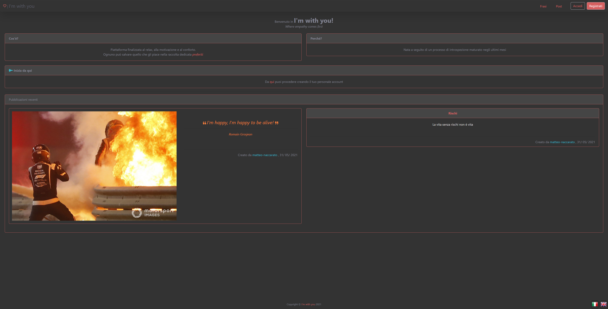
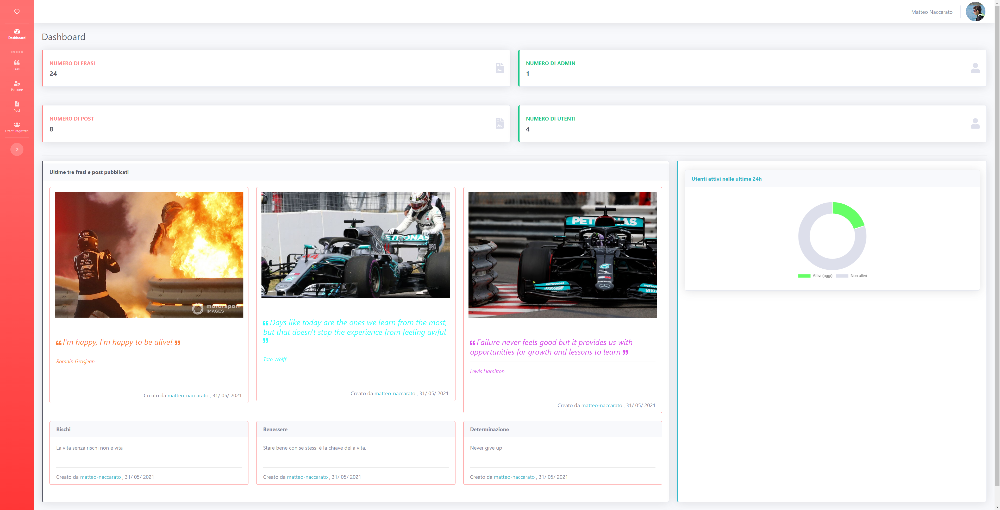

# I'm with you ♥
Emotional Support Web App 

Designed to find the right motivation through specific posts and quotes:
- Admins create content (posts and quotes)
- Users view and save the content they like

## Usage
1. Download [Node.js](https://nodejs.org/en/download)
2. ```cd im-with-you```
3. ```npm i``` to install the required Node packages
4. ```npm run dev``` to start the environment in dev mode
5. Connect to http://localhost:5000/

**NB**: *.env* file with *SESSION_SECRET*, *AWS_BUCKET_NAME*, *AWS_BUCKET_REGION*, *AWS_ACCESS_KEY*, *AWS_SECRET_KEY* inside is required to work with [AWS-S3](https://aws.amazon.com/it/s3/) storage

## What I learnt
- Interaction with remote services such as [AWS-S3](https://aws.amazon.com/it/s3/)
- Management of projects and deadlines through specific techniques (Burn Down Chart / WBS / Gantt chart / CPM)
- **AGILE** methodology

<hr>

### Home


### Admin dashboard

